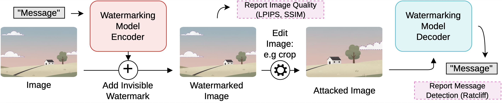
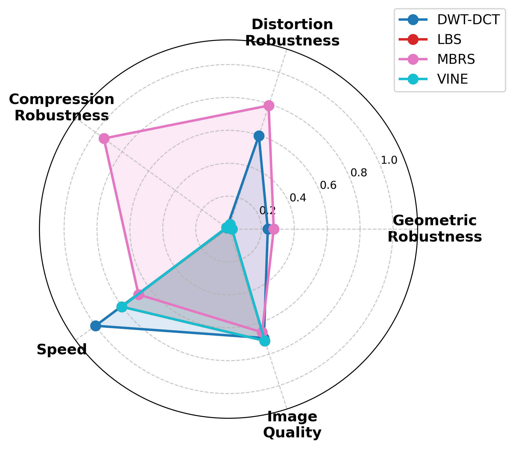

# Data-Security: Watermarking Research & WaterBench Application

A comprehensive watermarking research platform combining **algorithm benchmarking** and an interactive **web application** for exploring and testing image watermarking techniques.

<p align="center">
  
</p>

<p align="center"><em>Figure 1: Our benchmarking pipeline follows a three step process given an image: (1) encode a message as an invisible watermark in the image using one of the methods discussed in \autoref{sec:related_work}, (2) compute image quality metrics on the watermarked image to assess its imperceptibility, (3) attack the watermarked image with a transformation (e.g. cropping the image) (4) use the methods decoder to extract the message from the attacked watermarked image and (5) compute watermark detection metrics. </em></p>

The research paper and presentation slides are available in [`docs/`](docs/) ([Paper](docs/DEDS_Paper.pdf) | [Presentation](docs/DEDS_Presentation.pdf)).


---

## Overview

This repository serves two purposes:

1. **Benchmarking** - Systematic evaluation of watermarking algorithms against various attacks
2. **WaterBench** - An interactive web application for demonstrating watermarking capabilities and cryptographic ownership claims

---

## Project Structure

```
Data-Security/
├── benchmark/           # Benchmarking scripts and results
│   ├── pipeline.py      # Main benchmark execution engine
│   ├── visualization.py # Results visualization and plotting
│   ├── vendor/          # Watermarking algorithm implementations
│   ├── results/         # Benchmark result JSON files
│   └── figures/         # Generated plots and visualizations
│
├── watermark-app/       # React frontend application
│   └── src/
│       ├── pages/       # Landing, Challenge, Benchmark, Ownership
│       └── components/  # Reusable UI components
│
└── watermark-backend/   # FastAPI backend server
    └── src/
        ├── server.py    # FastAPI application entry
        ├── api_routes.py# REST API endpoints
        └── vendor/      # Algorithm implementations
```

---

## Watermarking Methods

| Method | Type | Robustness | Description |
|--------|------|:----------:|-------------|
| **LSB** | Spatial | Low | Least Significant Bit - fast but fragile baseline |
| **DWT-DCT** | Transform | Medium | Wavelet + cosine transform domain |
| **DWT-DCT-SVD** | Transform | High | Industry standard with SVD enhancement |
| **MBRS** | Deep Learning | High | Optimized for JPEG compression survival |
| **VINE** | Deep Learning | Very High | Diffusion-based restoration for editing robustness |

---

## Benchmark Results

The benchmark evaluates all methods against multiple attack categories:

- **Distortion**: Brightness, Contrast, Blur, Noise,
- **Geometric**: Rotation, Scaling, Cropping
- **Compression**: JPEG quality compression

### Robustness Comparison



*Spider plot comparing algorithm robustness across different attack types*

---

## Getting Started

### Prerequisites

- Python 3.10+
- Node.js 18+
- PyTorch (with MPS/CUDA support recommended)

### Benchmark Setup

```bash
cd benchmark

# Install dependencies
pip install torch torchvision diffusers transformers accelerate \
    invisible-watermark datasets numpy opencv-python kornia pillow

# Run benchmarks
python pipeline.py

# Generate visualizations
python visualization.py
```

### Backend Setup

```bash
cd watermark-backend

# Install dependencies
pip install -r requirements.txt

# Start server
python src/server.py
```

The API will be available at `http://localhost:8000`. API docs at `/docs`.

### Frontend Setup

```bash
cd watermark-app

# Install dependencies
npm install

# Start development server
npm run dev
```

The app will be available at `http://localhost:5174`.

---

## WaterBench Application

### Features

**Challenge Mode** - Interactive attack simulation
- Select image and watermarking algorithm
- Apply real-time attacks (blur, noise, rotation, compression)
- Extract and verify watermark survival

**Ownership Claims** - Cryptographic proof of authorship
- RSA-2048 key generation in browser
- Sign ownership claims with private key
- Verify claims with public key infrastructure

**Benchmark View** - Algorithm comparison dashboard
- Imperceptibility metrics (PSNR, SSIM)
- Performance metrics (embed/extract time)
- Robustness scores per attack type

---

## API Endpoints

| Endpoint | Method | Description |
|----------|--------|-------------|
| `/api/embed` | POST | Embed watermark into image |
| `/api/extract` | POST | Extract watermark from image |
| `/api/benchmark` | POST | Run benchmark on image |
| `/api/auth/register` | POST | Register user with public key |
| `/api/watermark/claim` | POST | Embed signed ownership claim |
| `/api/watermark/verify` | POST | Verify ownership claim |

---

## Technologies

**Frontend**: React 19, Vite, Tailwind CSS, WebCrypto API

**Backend**: FastAPI, PyTorch, Pillow, Cryptography

**Benchmarking**: PyTorch, Diffusers, HuggingFace Datasets, Kornia

---

## License

This project is for research and educational purposes. Check the [LICENSE](LICENSE) for more information.
